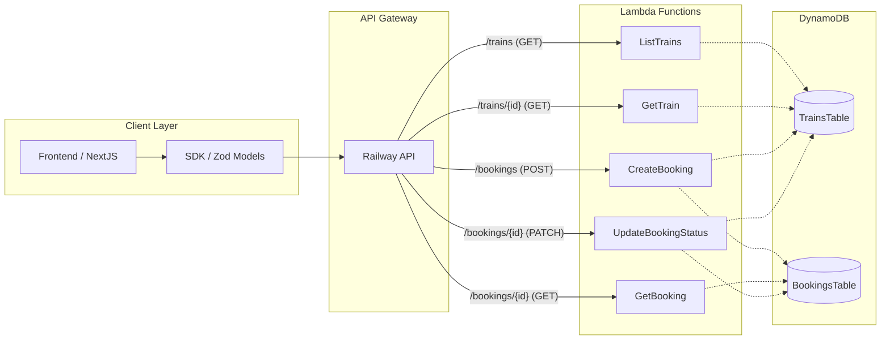

### System Topology
This project uses a Serverless REST Architecture managed via AWS CDK. The system is designed to handle railway operations by decoupling train inventory from user bookings.

#### Infrastructure Components

Entry Point: Amazon API Gateway (RestApi) providing a structured REST interface. 
Compute Layer: Specialized AWS Lambda functions for each CRUD operation. 
Persistence Layer: DynamoDB tables with high availability. 
Development Layer: Shared SDK providing Zod-validated models for all Lambdas. 

#### High-Level Flow
The diagram below illustrates the request lifecycle. Note how the Booking Lambdas act as a bridge between both tables to ensure data integrity.

### Persistence Layer (DynamoDB)
This system uses a Multi-Table Design to separate core inventory from user transactions. This separation allows us to scale read-heavy train searches independently from write-heavy booking operations.

Table: `TrainsTable`
Partition Key (PK): trainId (String)

Purpose: Acts as the authoritative source for train schedules and seat availability.

Access Pattern: High-frequency reads by ListTrains and GetTrain.

Table: `BookingsTable`
Partition Key (PK): bookingId (String)

Purpose: Records individual passenger transactions and their current status.

Access Pattern: Write-once (Create), followed by specific status updates (PATCH).

### Data Integrity & Consistency
The system implements a Dual-Write Pattern to maintain consistency between the BookingsTable and the TrainsTable.

#### The Booking Flow (State Transition)
When a booking is created or cancelled, the system orchestrates a state change across both tables:

Validation: The TrainsTable is queried to verify seat availability.

Transaction Record: A new record is inserted into the BookingsTable.

Inventory Update: The TrainsTable is updated to reflect the new seat status (marking isBooked: true/false and linking the bookingId).

### The Request Lifecycle (The Execution Flow)
This section traces a standard request (e.g., `POST /bookings`) through the system's layers. All API endpoints follow this same "Onion" Architecture pattern.

#### Standard Execution Steps
##### Ingress & Middleware (Middy):
The raw event is received from API Gateway. jsonBodyParser transforms the body, and our custom middyApiGateway wrapper initializes the response headers and error handling.

##### Contract Validation (SDK/Zod):
The handler uses the SDK's Zod Schemas to validate the input.
Example: `CreateBookingDto.parse(body)` ensures the payload matches the system's "Single Source of Truth" before any logic executes.

##### Domain Logic (Core):
The validated data is passed to the core layer. For a booking, `addBooking()` performs a State Check against the TrainsTable to verify the seat is free.

##### Side Effects & Persistence:
The system performs the necessary writes to DynamoDB. In the booking flow, this involves:

Creating a record in BookingsTable.

Updating the seat array in TrainsTable.

##### Egress (Success Path):
When the business logic succeeds, the handler returns the data via the respondOk() utility.

Structure: The response is wrapped in a consistent { data: T } envelope.

Serialization: The httpResponseSerializer middleware automatically handles stringifying the body to JSON and setting the Content-Type: application/json header, ensuring a "clean snap" with the Frontend's API client.

##### Error Handling (The Safety Net):
We utilize a custom `httpErrorHandler` middleware within the Middy pipeline to catch all exceptions and normalize them. This ensures that the Frontend never receives a "raw" Lambda crash, but instead a structured error response.

The system differentiates between three primary error types:

Contract Violations (`ZodError`): If the input fails to match the SDK schemas, the middleware extracts the Zod issues and maps them to a 400 Bad Request. Each issue is returned with a title and meta field for granular frontend feedback.

Controlled Failures (`HttpError`): For known business rule violations (e.g., "Seat already booked"), we throw a custom `HttpError` which carries a specific status code and message.

Unhandled Exceptions: Any unexpected code failures are caught and returned as a 500 Internal Server Error, hiding sensitive stack traces while providing a generic "Unknown error" title.
